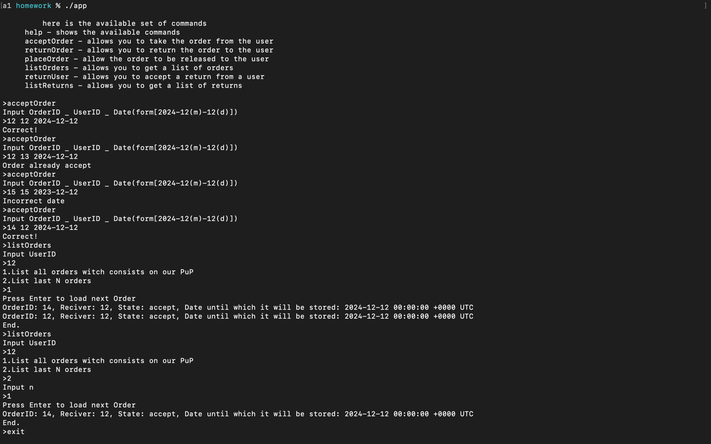
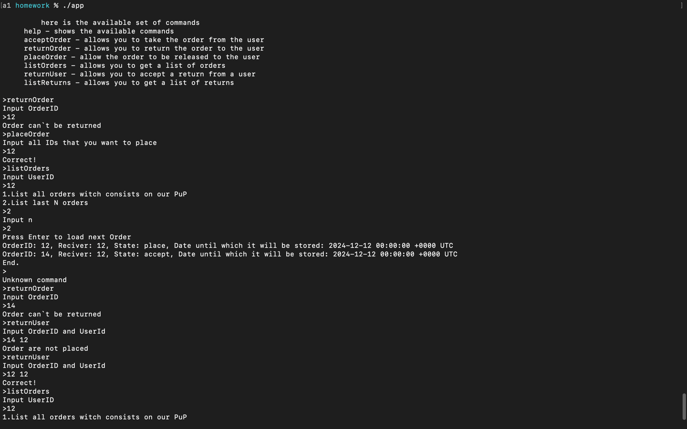
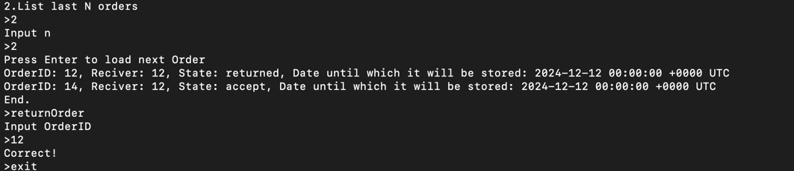
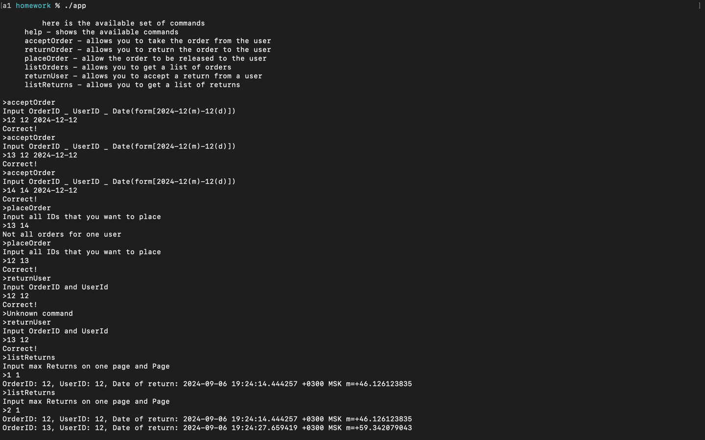

# Курсовой проект 15-го потока Route256 Go junior

ДЗ 1

Необходимо реализовать консольную утилиту, реализующую взаимодействие менеджера ПВЗ с курьером и покупателем.

Программа должна обладать командой help, благодаря которой можно получить список доступных команд с кратким описанием.

Список команд для реализации:

1. Принять заказ от курьера На вход принимается ID заказа, ID получателя и срок хранения. Заказ нельзя принять дважды. Если срок хранения в прошлом, приложение должно выдать ошибку. Список принятых заказов необходимо сохранять в файл. Формат файла остается на выбор автора.
2. Вернуть заказ курьеру На вход принимается ID заказа. Метод должен удалять заказ из вашего файла. Можно вернуть только те заказы, у которых вышел срок хранения и если заказы не были выданы клиенту.
3. Выдать заказ клиенту На вход принимается список ID заказов. Можно выдавать только те заказы, которые были приняты от курьера и чей срок хранения ещё не истек. Все ID заказов должны принадлежать только одному клиенту.
4. Получить список заказов На вход принимается ID пользователя как обязательный параметр и опциональные параметры. Параметры позволяют получать только последние N заказов или заказы клиента, находящиеся в нашем ПВЗ.
5. Принять возврат от клиента На вход принимается ID пользователя и ID заказа. Заказ может быть возвращен в течение двух дней с момента выдачи. Также необходимо проверить, что заказ выдавался с нашего ПВЗ.
6. Получить список возвратов Метод должен выдавать список с постраничной пагинацией.

Дополнительные задания:
1. В запросе "Получить список заказов" реализовать пагинацию скролом
2. При реализации приложения использовать https://github.com/spf13/cobra/blob/main/site/content/user_guide.md#help-command
3. Сохранять данные в файле в формате JSON

Дедлайны сдачи и проверки задания:
7 сентября 23:59 (сдача) / 10 сентября, 23:59 (проверка)

## Ориентация:
- [Команды](#команды)
- [Примеры](#примеры-работы-команд)

# Команды
-  acceptOrder  - Позволяет принять заказ от курьера
-  returnOrder  - Позволяет вернуть заказ курьеру
-  placeOrder  - Позволяет доставить заказ клиенту
-  listOrders  - Позволяет показать список всех заказов клиента
-  returnUser  - Позволяет клиенту вернуть заказ на ПВЗ
-  listReturns  - Позволяет показать список всех возвратов

# Примеры работы команд
- acceptOrder + listOrders

- returnOrder + placeOrder + returnUser

- listReturns

